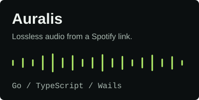
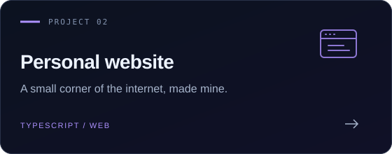
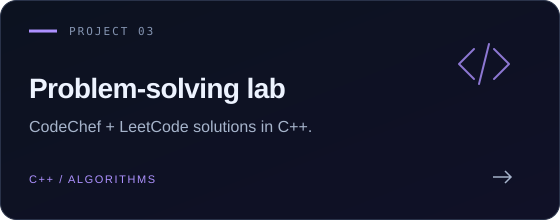
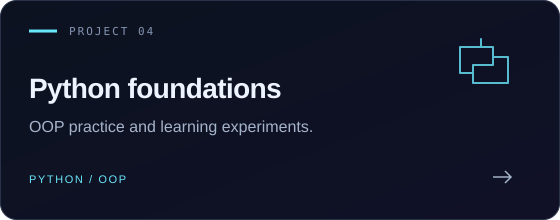

  

  <a href="https://vekhyat.github.io"><b>Website ↗</b></a> &nbsp; · &nbsp;
  <a href="https://www.linkedin.com/in/vekhyat-jain-562776364"><b>LinkedIn ↗</b></a> &nbsp; · &nbsp;
  <a href="mailto:vekhyatjain123@gmail.com"><b>Email ↗</b></a>

 

### Hey, I'm Vekhyat.

I'm a student at **TIET, Patiala**, building desktop apps and web projects while sharpening my problem-solving skills. This is where I share what I'm making and what I'm learning along the way.

**In my toolkit** &nbsp; `TypeScript` · `Python` · `C++` · `Go`

 

### Selected work

  
  

  
  

<a href="https://github.com/vekhyat?tab=repositories">Explore all public repositories →</a>

 

---

Learning by building. One commit at a time.

