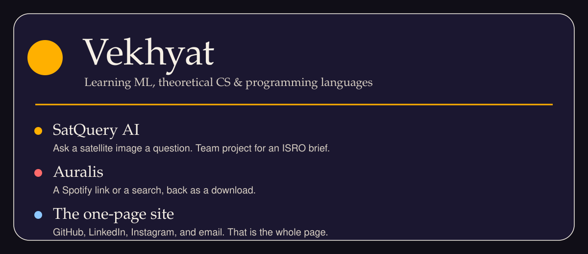

I'm learning **machine learning, theoretical computer science, and programming languages** on my own. **Python and C++** are the languages I know. These projects are part of what I'm working on.

### [SatQuery AI](https://github.com/vekhyat/SatQuery-AI)

Team project for an ISRO problem statement. Upload a satellite image, ask a question, and it returns the evidence.

### [Auralis](https://github.com/vekhyat/Auralis)

Desktop app. A Spotify link or a search comes back from Tidal, Qobuz, Amazon Music, Deezer, Apple Music, or JioSaavn.

### [vekhyat.github.io](https://github.com/vekhyat/vekhyat.github.io)

One page. GitHub, LinkedIn, Instagram, and email.

[Website](https://vekhyat.github.io) · [LinkedIn](https://www.linkedin.com/in/vekhyat-jain-562776364) · [Email](mailto:vekhyatjain123@gmail.com)
